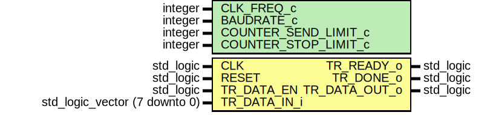

# Entity: TRANSMITTER_UART 

- **File**: TRANSMITTER_UART.vhd
## Diagram

## Generics

| Generic name         | Type    | Value       | Description                  |
| -------------------- | ------- | ----------- | ---------------------------- |
| CLK_FREQ_c           | integer | 100_000_000 | Clock frequency              |
| BAUDRATE_c           | integer | 115_200     | UART baudrate                |
| COUNTER_SEND_LIMIT_c | integer | 8           | Selected UART data bit width |
| COUNTER_STOP_LIMIT_c | integer | 2           | Stop state width             |
## Ports

| Port name     | Direction | Type                          | Description                                                     |
| ------------- | --------- | ----------------------------- | --------------------------------------------------------------- |
| CLK           | in        | std_logic                     | Clock port                                                      |
| RESET         | in        | std_logic                     | Reset port                                                      |
| TR_DATA_EN    | in        | std_logic                     | Data enable port which is asserted by the data sender to the TX |
| TR_DATA_IN_i  | in        | std_logic_vector (7 downto 0) | TX input data port                                              |
| TR_READY_o    | out       | std_logic                     | TX ready port                                                   |
| TR_DONE_o     | out       | std_logic                     | TX done port                                                    |
| TR_DATA_OUT_o | out       | std_logic                     | TX output data port                                             |
## Signals

| Name         | Type                                    | Description                                 |
| ------------ | --------------------------------------- | ------------------------------------------- |
| PS           | state_type                              | Present and Next State signal's declaration |
| NS           | state_type                              | Present and Next State signal's declaration |
| COUNTER_FREQ | integer range 0 to COUNTER_FREQ_LIMIT_c | Counter signal                              |
| COUNTER_SEND | integer range 0 to COUNTER_SEND_LIMIT_c | Counter signal for the send state           |
| COUNTER_STOP | integer range 0 to COUNTER_STOP_LIMIT_c | Counter signal for the stop state           |
| TR_SHFT      | std_logic_vector (7 downto 0)           | Shift register for the send state           |
| COUNTER_EN   | std_logic                               | Counter enabling signal                     |
| COUNTER_DONE | std_logic                               | Done signal for the counter                 |
| DATA_IN      | std_logic_vector (7 downto 0)           | Register for the input data                 |
| REG_OUT      | std_logic                               | Register for the output data                |
| REG_DONE     | std_logic                               | Register for the output done signal         |
## Constants

| Name                 | Type    | Value                     | Description                 |
| -------------------- | ------- | ------------------------- | --------------------------- |
| COUNTER_FREQ_LIMIT_c | integer | (CLK_FREQ_c / BAUDRATE_c) | Limit value for the counter |
## Types

| Name       | Type                                                                                                                                          | Description         |
| ---------- | --------------------------------------------------------------------------------------------------------------------------------------------- | ------------------- |
| state_type | (S_IDLE,  S_START,  S_SEND,  S_STOP) | Type for the states |
## Processes
- COUNTER_FREQ_P: ( CLK, RESET )
  - **Description**
  Counting is provided with this process and be used by the FSM's process
 
- FSM_SYNC_P: ( CLK, RESET )
  - **Description**
  FSM's states are synchronized in this state
 
- FSM_P: ( PS, TR_DATA_EN, COUNTER_DONE )
  - **Description**
  States are defined in this process
 
